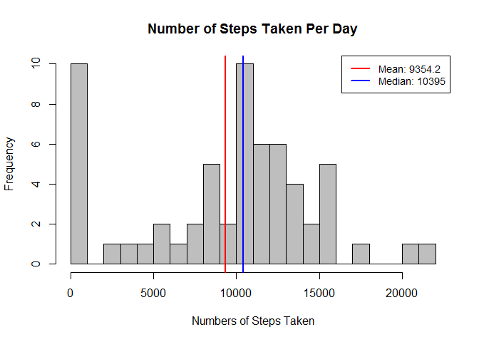
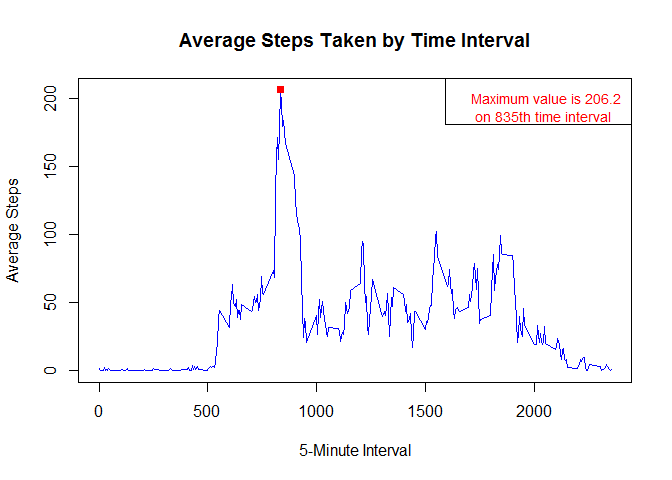
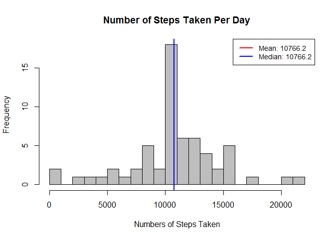
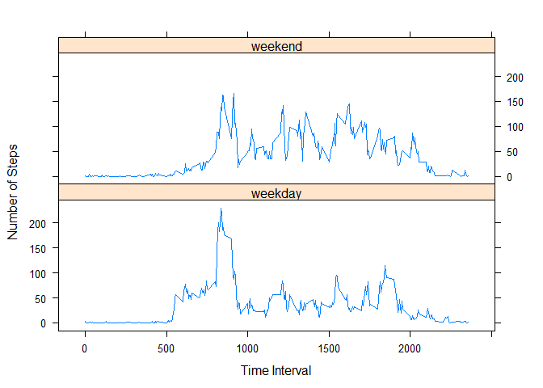

# Reproducible Research: Peer Assessment 1
Chen Qi  


## Loading and preprocessing the data
Let's load the data into memory and look into it:

```r
mydata <- read.csv('activity.csv');
str(mydata);
```

```
## 'data.frame':	17568 obs. of  3 variables:
##  $ steps   : int  NA NA NA NA NA NA NA NA NA NA ...
##  $ date    : Factor w/ 61 levels "2012-10-01","2012-10-02",..: 1 1 1 1 1 1 1 1 1 1 ...
##  $ interval: int  0 5 10 15 20 25 30 35 40 45 ...
```
After that, we transform the type of 'mydata$date' from "factor" to "numeric":

```r
mydata$date <- as.Date(mydata$date);
```

## What is mean total number of steps taken per day?
The first step is to calculate the total number of steps for each day:

```r
s <- split(mydata, mydata$date);
nStepsPerDay <- sapply(s, function(x) sum(x$steps, na.rm=TRUE));
```
Then we compute the mean and median values:

```r
mean_v <- round(mean(nStepsPerDay), 1);
median_v <- median(nStepsPerDay);
```
After that, we make a plot to show what we got:

```r
# 1. plot the number os steps taken
hist(nStepsPerDay, breaks=20, col='grey', main='Number of Steps Taken Per Day',
     xlab='Numbers of Steps Taken');
# 2. plot the mean and median values
abline(v=mean_v, lwd=2, col='red')
abline(v=median_v, lwd=2, col='blue')
# 3. create legend
legend('topright', lty=1, lwd=2, col=c('red','blue'), cex=0.9,
        legend=c(paste('Mean:', mean_v), paste('Median:', median_v)))
```

 


## What is the average daily activity pattern?
First, calculate the average steps taken for each 5-minute interval:

```r
s <- split(mydata, mydata$interval);
aveStepsPerInterval <- sapply(s, function(x) mean(x$steps, na.rm=TRUE));
all_intervals <- as.numeric(names(aveStepsPerInterval));
```
Then, find out which interval contains the maximum number of steps

```r
max_step <- round(max(aveStepsPerInterval), 1);
max_interval <- all_intervals[which.max(aveStepsPerInterval)];
```
At last, let's plot both the time series and the maximum steps

```r
# make plot 
# 1. plot the time series
plot(all_intervals, aveStepsPerInterval, 
     type='l', col='blue', lwd=1,
     main='Average Steps Taken by Time Interval',
     xlab='5-Minute Interval', ylab='Average Steps',
     )
# 2. plot the interval that contains the maximum number of steps
points(max_interval, max_step, col='red', lwd=2, pch=15);
title <- paste('Maximum value is ', max_step, ' \n on ', 
                    max_interval, 'th time interval', sep='');
legend('topright', text.col='red', cex=0.9, legend=title);
```

 


## Imputing missing values
1. Calculate the total number of missing values in the dataset:

```r
sum(is.na(mydata$steps))
```

```
## [1] 2304
```
2. Devise a strategy for filling in all of the missing values in the dataset. The strategy I am going to use is to replace the missing value with the mean of that 5-minute interval.

3. Create a new dataset that is equal to the original dataset but with the missing data filled in.

```r
# create a new dataset by copying the original dataset
mydata_new <- mydata;
# fill in the missing values with the mean of that 5-mintute interval (storing in variable 'aveStepsPerInterval')
s <- split(mydata_new, mydata$interval);
for (i in 1:length(s)) {
    ind <- is.na(s[[i]]$steps);
    s[[i]]$steps[ind] <- aveStepsPerInterval[i];
}
mydata_new <- unsplit(s, mydata_new$interval);   
# preview the new dataset
head(mydata_new)
```

```
##       steps       date interval
## 1 1.7169811 2012-10-01        0
## 2 0.3396226 2012-10-01        5
## 3 0.1320755 2012-10-01       10
## 4 0.1509434 2012-10-01       15
## 5 0.0754717 2012-10-01       20
## 6 2.0943396 2012-10-01       25
```
4. Make a histogram of the total number of steps taken each day and calculate and report the mean and median total number of steps taken per day.


```r
# compute total number of steps taken per day
s <- split(mydata_new, mydata_new$date);
nStepsPerDay_new <- sapply(s, function(x) sum(x$steps, na.rm=TRUE));
# calculate the mean and median values
mean_v_new <- round(mean(nStepsPerDay_new), 1);
median_v_new <- round(median(nStepsPerDay_new), 1);
# plot the histogram
hist(nStepsPerDay_new, breaks=20, col='grey', main='Number of Steps Taken Per Day',
     xlab='Numbers of Steps Taken');
abline(v=mean_v_new, lwd=2, col='red')
abline(v=median_v_new, lwd=2, col='blue')
legend('topright', lty=1, lwd=2, col=c('red','blue'), cex=0.9,
        legend=c(paste('Mean:', mean_v_new), paste('Median:', median_v_new)))
```

 

Question 1: Do these values differ from the estimates from the first part of the assignment? 

Answer: Yes.

Question 2: What is the impact of inputing missing data on the estimates of the total daily number of steps?

Answer: After replacing the missing data with the mean numbers of steps per time interval, the mean and median total number of steps taken per day becomes the same. This statement can be further confirmed as following:


```r
mean(nStepsPerDay_new) == median(nStepsPerDay_new)
```

```
## [1] TRUE
```


## Are there differences in activity patterns between weekdays and weekends?
1. Create a new factor variable in the dataset with two levels -- "weekday" and "weekend" indicating whether a given date is a weekday or weekend day.


```r
# set up system time to English
Sys.setlocale("LC_TIME", "English");
```

```
## [1] "English_United States.1252"
```

```r
# function to convert to "weekday" or "weekend"
convert = function (x) {
    if (x %in% c('Saturday', 'Sunday')) {
        return('weekend');
    }
    return('weekday');
}
# create the new factor variable
s <- weekdays(mydata_new$date);
mydata_new$daytype <- as.factor(apply(as.matrix(s), 1, convert));
# preview the dataset
str(mydata_new)
```

```
## 'data.frame':	17568 obs. of  4 variables:
##  $ steps   : num  1.717 0.3396 0.1321 0.1509 0.0755 ...
##  $ date    : Date, format: "2012-10-01" "2012-10-01" ...
##  $ interval: int  0 5 10 15 20 25 30 35 40 45 ...
##  $ daytype : Factor w/ 2 levels "weekday","weekend": 1 1 1 1 1 1 1 1 1 1 ...
```

2. Make a panel plot containing a time series plot (i.e. type = "l") of the 5-minute interval (x-axis) and the average number of steps taken, averaged across all weekday days or weekend days (y-axis).


```r
# calculate the 5-minute average number of steps
library(plyr)
df <- ddply(mydata_new, .(interval, daytype), summarize, avg_steps=mean(steps));
# make plot
library(lattice)
xyplot(avg_steps ~ interval | daytype,
       data = df,
       type='l', xlab='Time Interval', ylab='Number of Steps',
       layout=c(1,2))
```

 
